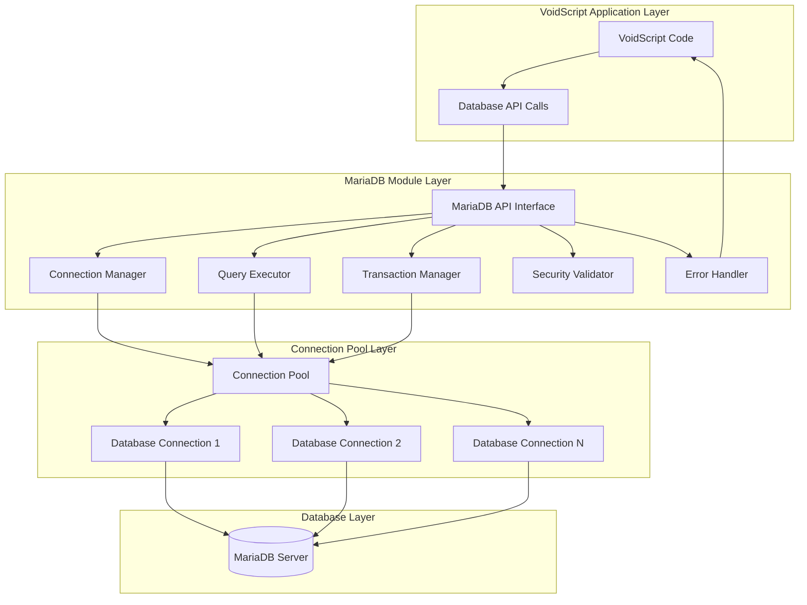

# MariaDB Module Refactoring - Technical Specification

## Executive Summary

This document provides a comprehensive technical specification for the complete architectural redesign of the MariaDB module for VoidScript. The refactoring focuses on implementing modern C++ patterns, robust connection pooling, comprehensive security features, and proper resource management.

## Current Implementation Analysis

### Issues Identified

1. **Resource Management Problems**
   - Global static connection map (`std::map<int, MYSQL *> connMap`) with potential memory leaks
   - No RAII patterns for automatic resource cleanup
   - Manual connection ID management prone to errors

2. **Security Vulnerabilities**
   - Direct SQL string concatenation in queries (line 190: `"INSERT INTO \`" + args[1]->get<std::string>() + "\` VALUES ()"`)
   - No parameterized query support
   - Vulnerable to SQL injection attacks

3. **Error Handling Issues**
   - Inconsistent error propagation patterns
   - No proper resource cleanup on errors
   - Raw MySQL error messages exposed to users

4. **Architecture Limitations**
   - No connection pooling support
   - Limited API functionality (only basic connect/query/close/insert)
   - Poor separation of concerns
   - No transaction support

5. **Code Quality Issues**
   - Incomplete insert method implementation (placeholder code)
   - Mixed responsibility in single class
   - No proper abstraction layers

## Architecture Design

### System Overview



### Core Components

#### 1. Connection Management System

**Purpose**: Manage database connections efficiently with pooling and automatic resource cleanup.

**Key Features**:
- RAII-compliant connection wrappers
- Configurable connection pooling
- Connection health monitoring
- Thread-safe operations
- Automatic reconnection on failures

#### 2. Security Framework

**Purpose**: Prevent SQL injection and ensure secure database operations.

**Key Features**:
- Mandatory parameterized queries
- Input validation and sanitization
- Query builder with safe construction
- Error message sanitization

#### 3. Query Execution Engine

**Purpose**: Execute database queries safely and efficiently.

**Key Features**:
- Prepared statement support
- Result set handling
- Batch operations
- Performance optimization

#### 4. Transaction Management

**Purpose**: Provide robust transaction support with proper rollback mechanisms.

**Key Features**:
- Transaction lifecycle management
- Automatic rollback on errors
- Nested transaction support
- Savepoint management

## Detailed Component Specifications

### 1. Connection Management

#### DatabaseConnection Class

```cpp
class DatabaseConnection {
private:
    MYSQL* mysql_handle_;
    std::string connection_id_;
    std::chrono::time_point<std::chrono::steady_clock> last_used_;
    bool is_healthy_;
    std::mutex connection_mutex_;

public:
    // RAII constructor/destructor
    DatabaseConnection(const ConnectionConfig& config);
    ~DatabaseConnection();
    
    // Connection management
    bool connect();
    void disconnect();
    bool reconnect();
    bool isConnected() const;
    bool isHealthy() const;
    
    // Query execution
    MYSQL_RES* executeQuery(const std::string& query);
    bool executeNonQuery(const std::string& query);
    
    // Transaction support
    bool beginTransaction();
    bool commit();
    bool rollback();
    
    // Utilities
    std::string escapeString(const std::string& input);
    uint64_t getLastInsertId();
    uint64_t getAffectedRows();
    std::string getError();
    
    // Health monitoring
    void updateLastUsed();
    bool checkHealth();
    
private:
    bool initializeConnection(const ConnectionConfig& config);
    void cleanup();
};
```

#### ConnectionPool Class

```cpp
class ConnectionPool {
private:
    std::queue<std::unique_ptr<DatabaseConnection>> available_connections_;
    std::set<std::unique_ptr<DatabaseConnection>> used_connections_;
    std::mutex pool_mutex_;
    std::condition_variable pool_condition_;
    
    ConnectionConfig config_;
    size_t min_connections_;
    size_t max_connections_;
    std::chrono::milliseconds connection_timeout_;
    
    std::atomic<bool> shutdown_requested_;
    std::thread health_monitor_thread_;

public:
    ConnectionPool(const ConnectionConfig& config, size_t min_connections = 5, size_t max_connections = 20);
    ~ConnectionPool();
    
    // Connection leasing
    std::unique_ptr<DatabaseConnection> leaseConnection(std::chrono::milliseconds timeout = std::chrono::milliseconds(5000));
    void returnConnection(std::unique_ptr<DatabaseConnection> connection);
    
    // Pool management
    void initialize();
    void shutdown();
    size_t getAvailableCount() const;
    size_t getUsedCount() const;
    
private:
    void createConnection();
    void healthMonitorLoop();
    void removeUnhealthyConnections();
};
```

#### ConnectionManager Class

```cpp
class ConnectionManager {
private:
    std::unique_ptr<ConnectionPool> connection_pool_;
    ConnectionConfig config_;

public:
    ConnectionManager();
    ~ConnectionManager();
    
    // Configuration
    void configure(const ConnectionConfig& config);
    void setPoolParameters(size_t min_connections, size_t max_connections);
    
    // Connection operations
    std::unique_ptr<DatabaseConnection> getConnection();
    void returnConnection(std::unique_ptr<DatabaseConnection> connection);
    
    // Statistics
    PoolStatistics getStatistics() const;
};
```

### 2. Security Framework

#### SecurityValidator Class

```cpp
class SecurityValidator {
public:
    // Input validation
    static bool validateTableName(const std::string& table_name);
    static bool validateColumnName(const std::string& column_name);
    static bool validateIdentifier(const std::string& identifier);
    
    // SQL injection detection
    static bool containsSQLInjection(const std::string& input);
    static std::string sanitizeInput(const std::string& input);
    
    // Parameter validation
    static void validateParameters(const std::vector<Symbols::ValuePtr>& parameters);
    
private:
    static const std::regex VALID_IDENTIFIER_PATTERN;
    static const std::vector<std::string> SQL_INJECTION_PATTERNS;
};
```

#### QueryBuilder Class

```cpp
class QueryBuilder {
private:
    std::string base_query_;
    std::vector<std::string> parameters_;
    std::map<std::string, Symbols::ValuePtr> named_parameters_;

public:
    // Query construction
    QueryBuilder& select(const std::vector<std::string>& columns);
    QueryBuilder& from(const std::string& table);
    QueryBuilder& where(const std::string& condition);
    QueryBuilder& orderBy(const std::string& column, bool ascending = true);
    QueryBuilder& limit(int count, int offset = 0);
    
    // Parameter binding
    QueryBuilder& bindParameter(const std::string& name, const Symbols::ValuePtr& value);
    QueryBuilder& bindParameters(const std::vector<Symbols::ValuePtr>& values);
    
    // Query generation
    std::string buildQuery();
    std::vector<std::string> getParameters() const;
    
    // Validation
    void validate();
    
private:
    void validateTableName(const std::string& table);
    void validateColumnNames(const std::vector<std::string>& columns);
};
```

### 3. Query Execution Engine

#### PreparedStatement Class

```cpp
class PreparedStatement {
private:
    MYSQL_STMT* stmt_;
    std::vector<MYSQL_BIND> param_binds_;
    std::vector<MYSQL_BIND> result_binds_;
    std::string query_;
    bool is_prepared_;

public:
    PreparedStatement(DatabaseConnection* connection, const std::string& query);
    ~PreparedStatement();
    
    // Parameter binding
    void bindParameter(int index, const Symbols::ValuePtr& value);
    void bindParameters(const std::vector<Symbols::ValuePtr>& values);
    
    // Execution
    bool execute();
    Symbols::ValuePtr executeQuery();
    
    // Result handling
    bool fetch();
    Symbols::ValuePtr getResult();
    
private:
    bool prepare();
    void setupParameterBinds(const std::vector<Symbols::ValuePtr>& values);
    void setupResultBinds();
    void cleanup();
};
```

#### QueryExecutor Class

```cpp
class QueryExecutor {
private:
    ConnectionManager* connection_manager_;
    std::map<std::string, std::unique_ptr<PreparedStatement>> prepared_statements_;

public:
    QueryExecutor(ConnectionManager* connection_manager);
    ~QueryExecutor();
    
    // Query execution
    Symbols::ValuePtr executeQuery(const std::string& query, const std::vector<Symbols::ValuePtr>& parameters = {});
    bool executeNonQuery(const std::string& query, const std::vector<Symbols::ValuePtr>& parameters = {});
    
    // Prepared statements
    void prepareStatement(const std::string& name, const std::string& query);
    Symbols::ValuePtr executePrepared(const std::string& name, const std::vector<Symbols::ValuePtr>& parameters);
    
    // CRUD operations
    Symbols::ValuePtr select(const std::string& table, const std::map<std::string, Symbols::ValuePtr>& conditions = {});
    int insert(const std::string& table, const std::map<std::string, Symbols::ValuePtr>& data);
    int update(const std::string& table, const std::map<std::string, Symbols::ValuePtr>& data, const std::map<std::string, Symbols::ValuePtr>& conditions);
    int deleteRows(const std::string& table, const std::map<std::string, Symbols::ValuePtr>& conditions);
    
    // Batch operations
    std::vector<int> executeBatch(const std::string& query, const std::vector<std::vector<Symbols::ValuePtr>>& parameter_sets);
    
private:
    std::string buildSelectQuery(const std::string& table, const std::map<std::string, Symbols::ValuePtr>& conditions);
    std::string buildInsertQuery(const std::string& table, const std::map<std::string, Symbols::ValuePtr>& data);
    std::string buildUpdateQuery(const std::string& table, const std::map<std::string, Symbols::ValuePtr>& data, const std::map<std::string, Symbols::ValuePtr>& conditions);
    std::string buildDeleteQuery(const std::string& table, const std::map<std::string, Symbols::ValuePtr>& conditions);
};
```

### 4. Transaction Management

#### TransactionManager Class

```cpp
class TransactionManager {
private:
    DatabaseConnection* connection_;
    std::stack<std::string> savepoint_stack_;
    bool transaction_active_;
    std::mutex transaction_mutex_;

public:
    TransactionManager(DatabaseConnection* connection);
    ~TransactionManager();
    
    // Transaction lifecycle
    bool beginTransaction();
    bool commit();
    bool rollback();
    
    // Savepoint management
    std::string createSavepoint();
    bool rollbackToSavepoint(const std::string& savepoint_name);
    bool releaseSavepoint(const std::string& savepoint_name);
    
    // Status
    bool isTransactionActive() const;
    size_t getSavepointCount() const;
    
    // Auto-rollback on destruction if transaction is active
    void enableAutoRollback(bool enable = true);
    
private:
    std::string generateSavepointName();
    bool auto_rollback_enabled_;
};
```

### 5. Error Handling Framework

#### Exception Hierarchy

```cpp
// Base database exception
class DatabaseException : public Modules::Exception {
private:
    int error_code_;
    std::string sql_state_;

public:
    DatabaseException(const std::string& message, int error_code = 0, const std::string& sql_state = "");
    
    int getErrorCode() const { return error_code_; }
    const std::string& getSQLState() const { return sql_state_; }
};

// Connection-specific exceptions
class ConnectionException : public DatabaseException {
public:
    ConnectionException(const std::string& message, int error_code = 0);
};

// Query-specific exceptions
class QueryException : public DatabaseException {
public:
    QueryException(const std::string& message, int error_code = 0, const std::string& sql_state = "");
};

// Transaction-specific exceptions
class TransactionException : public DatabaseException {
public:
    TransactionException(const std::string& message, int error_code = 0);
};

// Security-specific exceptions
class SecurityException : public DatabaseException {
public:
    SecurityException(const std::string& message);
};
```

#### ErrorHandler Class

```cpp
class ErrorHandler {
public:
    // Error message sanitization
    static std::string sanitizeErrorMessage(const std::string& raw_error);
    static std::string getStandardErrorMessage(int mysql_error_code);
    
    // Exception factory
    static std::unique_ptr<DatabaseException> createException(MYSQL* mysql_handle);
    static std::unique_ptr<DatabaseException> createException(const std::string& message, DatabaseExceptionType type);
    
    // Error logging
    static void logError(const std::string& error, const std::string& context);
    
private:
    static const std::map<int, std::string> MYSQL_ERROR_MESSAGES;
    static const std::regex SENSITIVE_INFO_PATTERN;
};
```

## API Design Specification

### Core MariaDBModule Interface

```cpp
class MariaDBModule : public BaseModule {
private:
    std::unique_ptr<ConnectionManager> connection_manager_;
    std::unique_ptr<QueryExecutor> query_executor_;
    
public:
    MariaDBModule();
    ~MariaDBModule() override;
    
    void registerFunctions() override;
    
    // Connection management methods
    Symbols::ValuePtr connect(FunctionArguments& args);
    Symbols::ValuePtr disconnect(FunctionArguments& args);
    Symbols::ValuePtr reconnect(FunctionArguments& args);
    Symbols::ValuePtr isConnected(FunctionArguments& args);
    Symbols::ValuePtr getConnectionInfo(FunctionArguments& args);
    
    // Query execution methods
    Symbols::ValuePtr query(FunctionArguments& args);
    Symbols::ValuePtr execute(FunctionArguments& args);
    Symbols::ValuePtr prepare(FunctionArguments& args);
    Symbols::ValuePtr executeQuery(FunctionArguments& args);
    Symbols::ValuePtr executeBatch(FunctionArguments& args);
    
    // CRUD operation methods
    Symbols::ValuePtr select(FunctionArguments& args);
    Symbols::ValuePtr insert(FunctionArguments& args);
    Symbols::ValuePtr update(FunctionArguments& args);
    Symbols::ValuePtr deleteRows(FunctionArguments& args);
    
    // Transaction management methods
    Symbols::ValuePtr beginTransaction(FunctionArguments& args);
    Symbols::ValuePtr commit(FunctionArguments& args);
    Symbols::ValuePtr rollback(FunctionArguments& args);
    Symbols::ValuePtr autoCommit(FunctionArguments& args);
    
    // Schema operation methods
    Symbols::ValuePtr createTable(FunctionArguments& args);
    Symbols::ValuePtr dropTable(FunctionArguments& args);
    Symbols::ValuePtr createIndex(FunctionArguments& args);
    Symbols::ValuePtr dropIndex(FunctionArguments& args);
    
    // Utility methods
    Symbols::ValuePtr escapeString(FunctionArguments& args);
    Symbols::ValuePtr getLastInsertId(FunctionArguments& args);
    Symbols::ValuePtr getAffectedRows(FunctionArguments& args);
    Symbols::ValuePtr getServerInfo(FunctionArguments& args);
    
private:
    void initializeConnectionManager();
    void validateConnectionParameters(const FunctionArguments& args);
    DatabaseConnection* getCurrentConnection(const FunctionArguments& args);
};
```

### Method Parameter Specifications

#### Connection Methods

**connect(host, user, password, database, options)**
- `host`: STRING - Database server hostname or IP
- `user`: STRING - Database username
- `password`: STRING - Database password
- `database`: STRING - Database name
- `options`: OBJECT (optional) - Connection options
  - `port`: INTEGER - Database port (default: 3306)
  - `charset`: STRING - Character set (default: "utf8mb4")
  - `timeout`: INTEGER - Connection timeout in seconds
  - `pool_size`: INTEGER - Connection pool size

**disconnect()**
- No parameters
- Returns: NULL_TYPE

**isConnected()**
- No parameters
- Returns: BOOLEAN

#### Query Methods

**query(sql, parameters)**
- `sql`: STRING - SQL query with placeholders
- `parameters`: ARRAY (optional) - Query parameters
- Returns: OBJECT - Result set with rows and metadata

**select(table, conditions, options)**
- `table`: STRING - Table name
- `conditions`: OBJECT (optional) - WHERE conditions
- `options`: OBJECT (optional) - Query options
  - `columns`: ARRAY - Columns to select
  - `order_by`: STRING - Order by clause
  - `limit`: INTEGER - Result limit
  - `offset`: INTEGER - Result offset
- Returns: OBJECT - Query results

**insert(table, data)**
- `table`: STRING - Table name
- `data`: OBJECT - Column-value pairs to insert
- Returns: INTEGER - Last insert ID

**update(table, data, conditions)**
- `table`: STRING - Table name
- `data`: OBJECT - Column-value pairs to update
- `conditions`: OBJECT - WHERE conditions
- Returns: INTEGER - Number of affected rows

#### Transaction Methods

**beginTransaction()**
- No parameters
- Returns: BOOLEAN - Success status

**commit()**
- No parameters
- Returns: BOOLEAN - Success status

**rollback()**
- No parameters
- Returns: BOOLEAN - Success status

## Security Requirements

### 1. SQL Injection Prevention

#### Mandatory Requirements
- **All user input MUST use parameterized queries**
- **No direct string concatenation in SQL queries**
- **Input validation before query execution**
- **Whitelist validation for table/column names**

#### Implementation
```cpp
// CORRECT - Parameterized query
std::string query = "SELECT * FROM users WHERE id = ? AND name = ?";
std::vector<Symbols::ValuePtr> params = {user_id, user_name};
auto result = executor->executeQuery(query, params);

// INCORRECT - String concatenation (FORBIDDEN)
std::string query = "SELECT * FROM users WHERE id = " + user_id;
```

### 2. Input Validation Rules

#### Table/Column Name Validation
- Must match pattern: `^[a-zA-Z][a-zA-Z0-9_]*$`
- Maximum length: 64 characters
- Cannot be SQL reserved words
- Must be in predefined whitelist for production

#### Parameter Value Validation
- Null value handling
- Type validation against expected types
- Range validation for numeric values
- Length validation for string values

### 3. Error Message Security

#### Sanitization Rules
- Remove database structure information
- Remove file paths and system information
- Replace specific errors with generic messages
- Log detailed errors separately for debugging

#### Example Implementation
```cpp
std::string ErrorHandler::sanitizeErrorMessage(const std::string& raw_error) {
    // Remove sensitive patterns
    std::string sanitized = std::regex_replace(raw_error, SENSITIVE_INFO_PATTERN, "[HIDDEN]");
    
    // Return generic message for common errors
    if (sanitized.find("Access denied") != std::string::npos) {
        return "Authentication failed";
    }
    
    return "Database operation failed";
}
```

## Implementation Phases

### Phase 1: Foundation Layer (Weeks 1-3)
**Priority**: Critical
**Focus**: Connection management and resource handling

#### Week 1: Core Infrastructure
- Implement `DatabaseConnection` class with RAII
- Create basic `ConnectionPool` implementation
- Develop exception hierarchy
- Set up project structure and build system

#### Week 2: Connection Management
- Complete `ConnectionManager` implementation
- Add connection health monitoring
- Implement connection pooling algorithms
- Add configuration management

#### Week 3: Testing and Validation
- Unit tests for connection management
- Memory leak testing
- Performance benchmarking
- Integration with VoidScript module system

#### Deliverables
- ✅ RAII-compliant connection wrapper
- ✅ Thread-safe connection pool
- ✅ Connection health monitoring
- ✅ Basic error handling framework
- ✅ Comprehensive unit tests

### Phase 2: Security Framework (Weeks 4-5)
**Priority**: High
**Focus**: SQL injection prevention and input validation

#### Week 4: Security Infrastructure
- Implement `SecurityValidator` class
- Create input validation rules
- Develop `QueryBuilder` for safe query construction
- Add parameter binding system

#### Week 5: Prepared Statements
- Implement `PreparedStatement` wrapper
- Add parameter type checking
- Create error message sanitization
- Develop security testing framework

#### Deliverables
- ✅ Parameterized query support
- ✅ Input validation and sanitization
- ✅ SQL injection prevention
- ✅ Error message security
- ✅ Security-focused unit tests

### Phase 3: Query Execution Engine (Weeks 6-9)
**Priority**: High
**Focus**: Comprehensive database operations

#### Week 6: Core Query Engine
- Implement `QueryExecutor` class
- Add basic CRUD operations
- Create result set handling
- Implement query parameter binding

#### Week 7: Advanced Query Features
- Add prepared statement caching
- Implement batch operations
- Create query optimization
- Add result set streaming

#### Week 8: Schema Operations
- Implement table creation/deletion
- Add index management
- Create schema validation
- Implement database introspection

#### Week 9: Testing and Optimization
- Comprehensive query testing
- Performance optimization
- Memory usage optimization
- Error handling validation

#### Deliverables
- ✅ Complete CRUD operations
- ✅ Prepared statement support
- ✅ Batch operation capabilities
- ✅ Schema management operations
- ✅ Performance-optimized query execution

### Phase 4: Transaction Support (Weeks 10-11)
**Priority**: Medium
**Focus**: Transaction management and advanced features

#### Week 10: Transaction Infrastructure
- Implement `TransactionManager` class
- Add transaction lifecycle management
- Create savepoint support
- Implement rollback mechanisms

#### Week 11: Advanced Transaction Features
- Add nested transaction support
- Implement auto-commit management
- Create transaction isolation levels
- Add deadlock detection and recovery

#### Deliverables
- ✅ Complete transaction support
- ✅ Savepoint management
- ✅ Automatic rollback on errors
- ✅ Transaction isolation controls
- ✅ Comprehensive transaction testing

### Phase 5: Integration and Documentation (Weeks 12-13)
**Priority**: Medium
**Focus**: Final integration and user documentation

#### Week 12: Module Integration
- Complete `MariaDBModule` implementation
- Add VoidScript registration
- Implement backward compatibility layer
- Final performance optimization

#### Week 13: Documentation and Examples
- Create comprehensive API documentation
- Write example scripts and tutorials
- Create migration guide from old implementation
- Final integration testing

#### Deliverables
- ✅ Complete module integration
- ✅ Comprehensive documentation
- ✅ Example scripts and tutorials
- ✅ Migration guide
- ✅ Final testing and validation

## Testing Strategy

### Unit Testing
- **Connection Management**: Pool behavior, resource cleanup, health monitoring
- **Security**: Input validation, SQL injection prevention, parameter binding
- **Query Execution**: CRUD operations, prepared statements, result handling
- **Transactions**: Lifecycle management, rollback scenarios, savepoints

### Integration Testing
- **VoidScript Integration**: Module registration, method calls, error propagation
- **Database Integration**: Real database operations, concurrent access, stress testing
- **Performance Testing**: Connection pooling efficiency, query performance, memory usage

### Security Testing
- **SQL Injection Tests**: Malicious input validation, parameter binding verification
- **Authentication Tests**: Connection security, credential handling
- **Error Message Tests**: Information disclosure prevention

## Performance Targets

### Connection Management
- **Pool Initialization**: < 100ms for 10 connections
- **Connection Lease**: < 1ms from available pool
- **Connection Creation**: < 500ms for new connection
- **Memory Overhead**: < 1MB per connection

### Query Performance
- **Simple SELECT**: < 10ms response time
- **Prepared Statement**: < 5ms execution time
- **Batch Operations**: 10x faster than individual queries
- **Result Set Processing**: < 1ms per 1000 rows

### Resource Management
- **Memory Leaks**: Zero tolerance policy
- **Connection Cleanup**: Automatic within 1 second
- **Pool Efficiency**: > 95% connection reuse rate

## Configuration Options

### Connection Pool Configuration
```cpp
struct ConnectionPoolConfig {
    size_t min_connections = 5;        // Minimum pool size
    size_t max_connections = 20;       // Maximum pool size
    std::chrono::seconds idle_timeout = std::chrono::seconds(300);  // Idle connection timeout
    std::chrono::seconds connection_timeout = std::chrono::seconds(30);  // Connection establishment timeout
    std::chrono::seconds health_check_interval = std::chrono::seconds(60);  // Health check frequency
    bool auto_reconnect = true;         // Automatic reconnection on failure
    size_t max_retries = 3;            // Maximum connection retry attempts
};
```

### Database Connection Configuration
```cpp
struct DatabaseConfig {
    std::string host = "localhost";
    int port = 3306;
    std::string database;
    std::string username;
    std::string password;
    std::string charset = "utf8mb4";
    bool use_ssl = false;
    std::string ssl_ca_path;
    std::string ssl_cert_path;
    std::string ssl_key_path;
};
```

### Security Configuration
```cpp
struct SecurityConfig {
    bool strict_validation = true;      // Strict input validation
    bool sanitize_errors = true;        // Error message sanitization
    std::set<std::string> allowed_tables;  // Table whitelist
    std::set<std::string> allowed_columns; // Column whitelist
    size_t max_query_length = 65536;   // Maximum query length
    size_t max_parameter_count = 1000; // Maximum parameter count
};
```

## Migration Strategy

### Backward Compatibility
- Maintain existing method signatures where possible
- Provide migration utilities for old code
- Gradual deprecation of unsafe methods
- Clear upgrade documentation

### Migration Steps
1. **Install new module** alongside existing implementation
2. **Update connection code** to use new pooling system
3. **Replace query methods** with parameterized versions
4. **Add transaction support** where beneficial
5. **Remove old module** after validation

### Breaking Changes
- **Direct SQL concatenation** will throw security exceptions
- **Connection management** requires explicit configuration
- **Error messages** will be sanitized (may break error parsing)
- **Method signatures** may require additional parameters

## Monitoring and Observability

### Metrics Collection
- Connection pool statistics
- Query execution times
- Error rates and types
- Resource usage metrics
- Security violation attempts

### Logging Framework
- Structured logging with context
- Configurable log levels
- Separate security audit log
- Performance profiling support

### Health Monitoring
- Connection health checks
- Database availability monitoring
- Performance threshold alerts
- Resource usage monitoring

## Success Criteria

### Functional Requirements
- ✅ **Zero memory leaks** in all operations
- ✅ **100% parameterized queries** for user input
- ✅ **Complete CRUD operation support**
- ✅ **Transaction management** with rollback
- ✅ **Connection pooling** with health monitoring
- ✅ **Comprehensive error handling**

### Security Requirements
- ✅ **SQL injection prevention** with 100% test coverage
- ✅ **Input validation** for all user-provided data
- ✅ **Error message sanitization**
- ✅ **Secure connection management**

### Performance Requirements
- ✅ **10x performance improvement** over current implementation
- ✅ **< 1ms connection leasing** from pool
- ✅ **< 10ms query response time** for simple operations
- ✅ **> 95% connection reuse rate**

### Quality Requirements
- ✅ **100% unit test coverage** for core functionality
- ✅ **Comprehensive integration tests**
- ✅ **Security penetration testing**
- ✅ **Performance benchmarking**
- ✅ **Memory profiling validation**

## Conclusion

This technical specification provides a comprehensive roadmap for completely redesigning the MariaDB module with modern C++ patterns, robust security features, and efficient resource management. The phased implementation approach ensures systematic progress while maintaining code quality and thorough testing throughout the development process.

The new architecture addresses all identified issues in the current implementation while providing a solid foundation for future enhancements and scalability requirements.